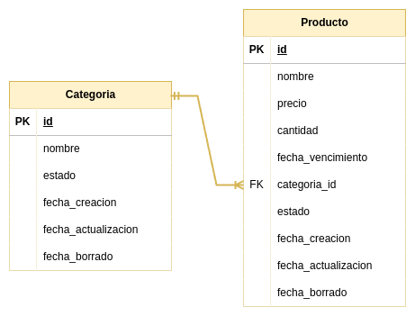

# Proyecto: `ProductoApi`

## Descripción  

* API para gestionar productos y categorías.

* 

## Tecnologías

* Python 3.12.3
* FastAPI
* SQLAlchemy
* PostgreSQL
* Docker
* Docker Compose
* Swagger   

# Herramientas

* Git
* Github
* Antigravity

# Instalación

* [Documentacion](/Container/README.md)

